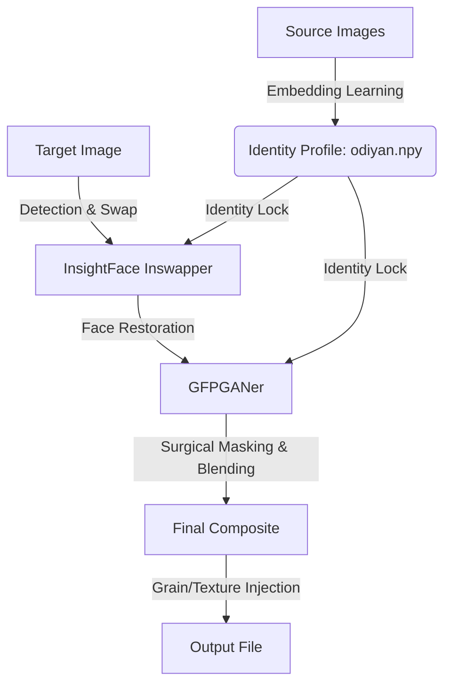

# Odiyan (by Hora) Architecture

This pipeline is designed for high-fidelity, surgical-grade identity replacement. It operates in distinct phases, optimizing for local CPU execution while maintaining professional output quality.

## Architectural Flow

## Core Components

- **`OdiyanOrchestrator`**: The central controller. Responsible for learning Odiyan's identity from reference images, calculating the 3D-profile, and managing the surgical integration pipeline.
- **`InsightFace Inswapper`**: Handles the foundational identity transfer.
- **`GFPGANer`**: Used in the final stages to restore high-frequency facial features lost during the base swap, while preserving skin texture via mask-based blending.
- **`Surgical Masking`**: A proprietary landmark-based mask generation technique that targets strictly internal facial features (inner landmarks 33-106), ensuring zero distortion of the target's original jaw, neck, hair, or surroundings.

## Workflow

1.  **Identity Learning**: The `learn_odiyan` method calculates the average facial embedding from reference photos in `data/references/odiyan/` and saves it as a persistent NumPy array.
2.  **Odiyan**:
    - `execute_swap` takes a target image.
    - InsightFace performs an initial swap to set the identity.
    - GFPGAN restores the face to address resolution artifacts.
    - `_integrate_face` uses a 106-point landmark hull to create an invisible feathering mask, blending the restored face onto the base swap.
    - Final identity validation is performed if necessary.
3.  **Output**: Refined images are exported to `output/samples/odiyan_swaps/`.
